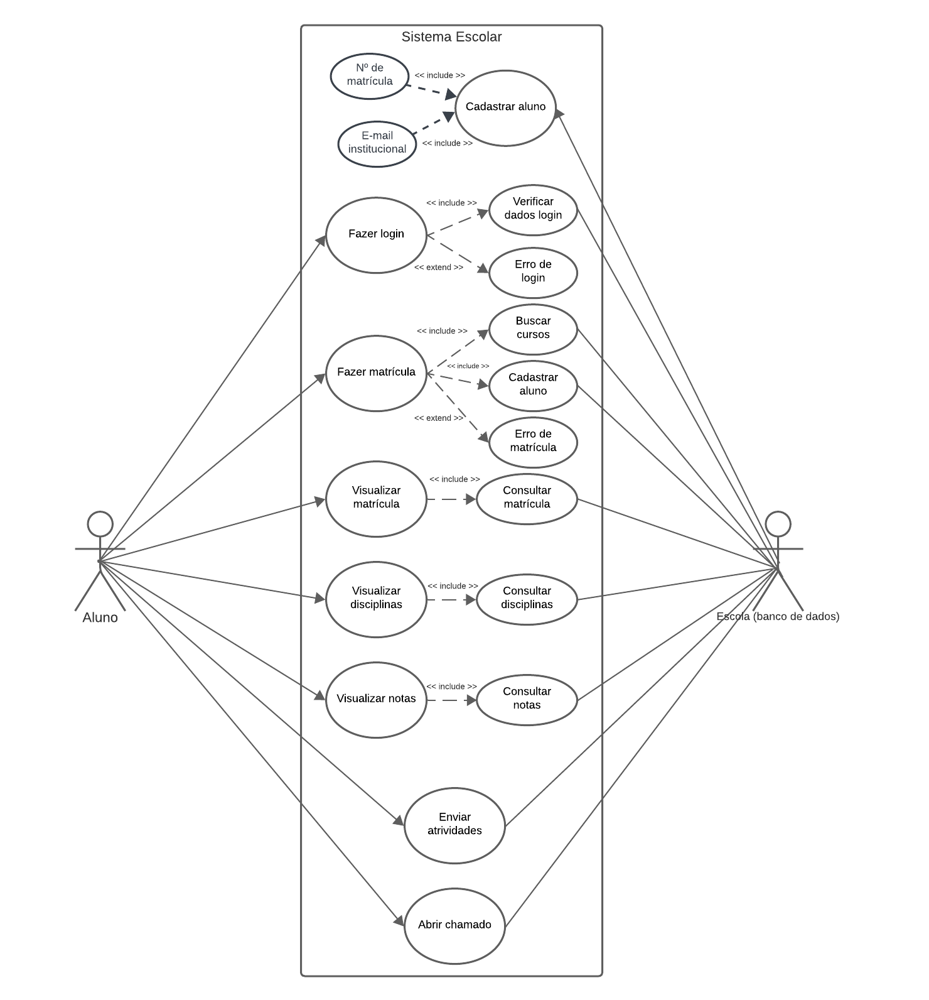
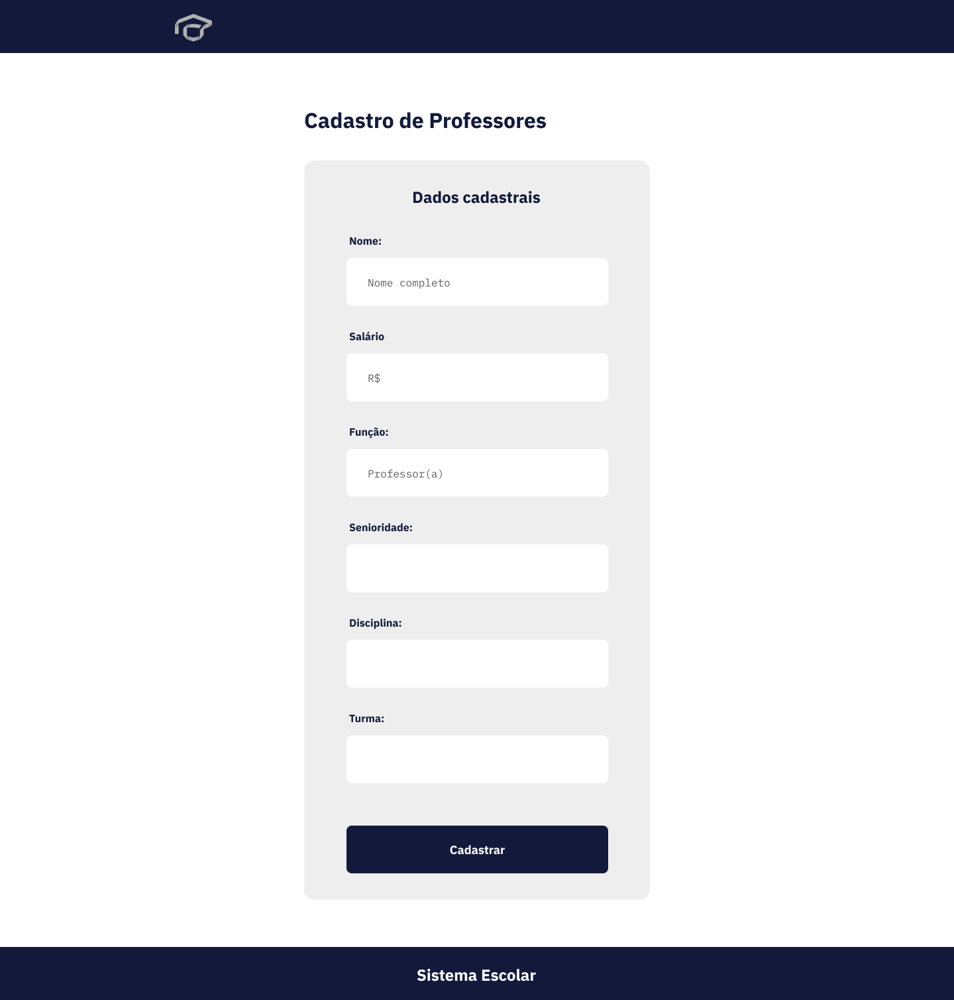
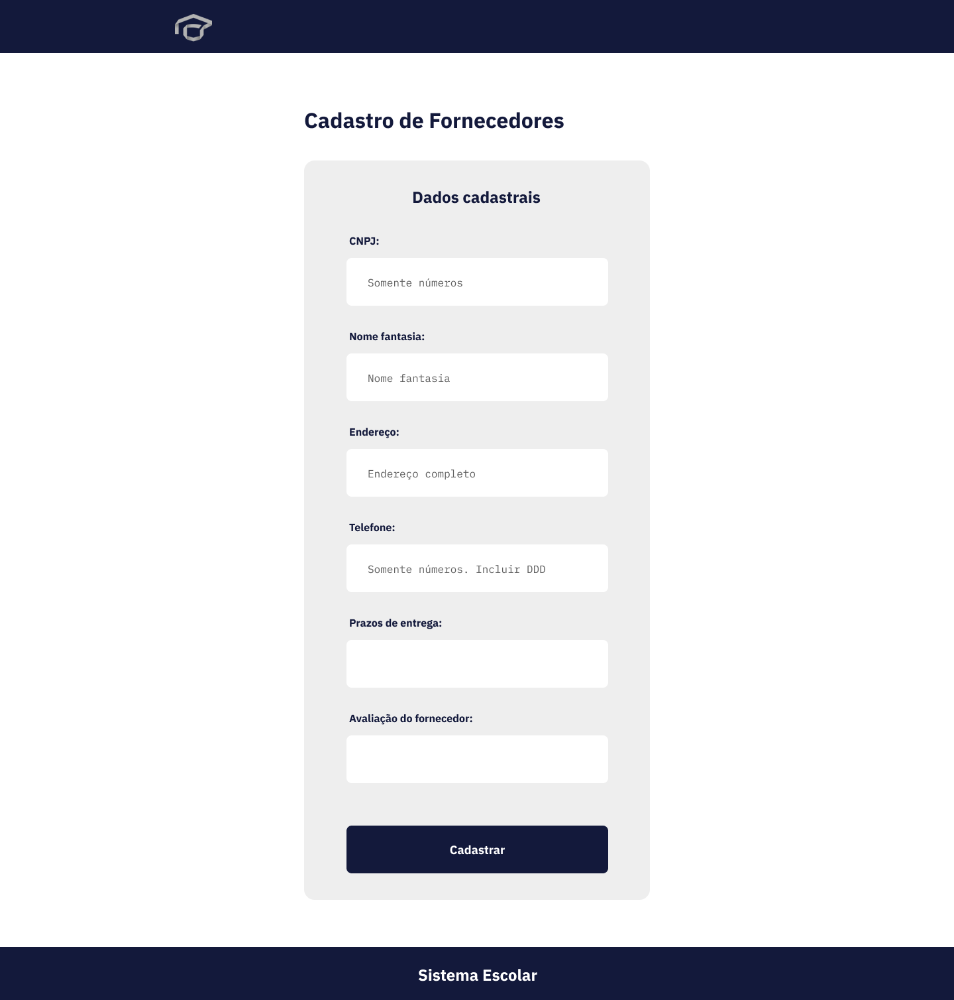

# Projeto Integrador - Desenvolvimento de Sistemas Dinâmicos Baseados na Web

## Enunciado
Desenvolver os protótipos da interface do sistema de acordo com os diagramas desenvolvidos na primeira fase do projeto.

## Conteúdo
- [Diagramas de Caso de Uso](#diagrama-de-caso-de-uso)
- [Diagramas de Classes](#diagrama-de-classes)
- [Protótipos](#protótipos)

## Diagrama de Casos de Uso
Para a segunda entrega os diagramas de caso de uso passaram por uma revisão seguindo as recomendações de correção.

### Primeiro Diagrama de Casos de Uso:

### Diagrama revisado e dividido:

#### Aluno

#### Pessoa Física e Professor

#### Pessoa Jurídica e Fornecedor

## Diagrama de Classes
Desenvolvido para a primeira entrega do projeto:

## Protótipos
Geral:
- [Página Inicial](#protótipo-página-inicial)

Atores:
- [Aluno](#protótipo-aluno)
- [Pessoa Física e Professor](#protótipo-pessoa-física-e-professor)
- [Pessoa Jurídica e Fornecedor](#protótipo-pessoa-jurídica-e-fornecedor)

### Protótipo Página Inicial
Recebe o acesso de todos os atores.

### Protótipo Aluno
Recebe o acesso de estudantes e alunos da instituição.

#### Página de Cadastro

#### Página de Login

#### Página de Cursos

#### Página Inicial Aluno Autenticado

### Protótipo Pessoa Física e Professor
Recebe o acesso de funcionários em geral e professores da instituição.

#### Página de Cadastro Pessoa Física

#### Página de Cadastro Professor

#### Página de Login

#### Página Inicial para Pessoa Física autenticada

#### Página Inicial para Professor autenticado

### Protótipo Pessoa Jurídica e Fornecedor
Recebe os acesso de pessoas jurídicas em geral (colaboradores) e fornecedores da instituição.

#### Página de Cadastro Pessoa Jurídica

#### Página de Cadastro Fornecedor

#### Página de Login

#### Página Inicial Pessoa Jurídica e Fornecedor
